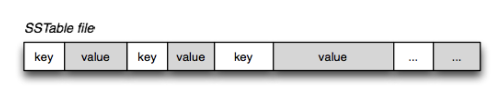
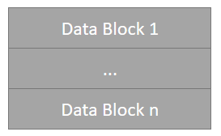
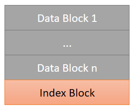
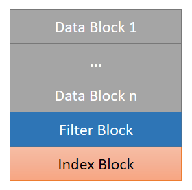
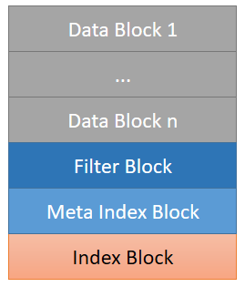
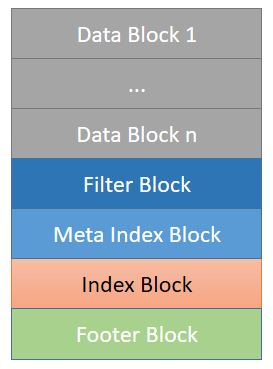

[leveldb sstable](https://leveldb-handbook.readthedocs.io/zh/latest/sstable.html) 这篇讲leveldb中sstable的文章确实不错，但刚开始看仍然会很懵逼。  
  
从这张图说起吧，一开始就看到这张图，我的第一反应就是——好复杂，不就是存个key value吗，为什么有这么多block，分这么多层？  

不妨去想想，如果我去设计sstable，会怎么设计？不可能一开始就会分这么多层吧，一定是为了解决某个问题，然后引入了某个block。  

一开始就看这么复杂的结构，可能脱离了sstable的本质。[SSTable and Log Structured Storage: LevelDB](https://www.igvita.com/2012/02/06/sstable-and-log-structured-storage-leveldb/) 这篇文章给我了很大的启发，sstable的本质就是字面意思，"Sorted String Table"，存储按序排列key value字符串，就像下面这张图一样。  
> A "Sorted String Table" then is exactly what it sounds like, it is a file which contains a set of arbitrary, sorted key-value pairs inside.  

  

现在再来看看leveldb中sstable的设计。 

首先来看看我们核心要存储的key value放在什么地方？  
data block  

我们先忽略data block的具体设计，只需要知道data block是存储key value就行了。  

一个data block不要存储太多的数据，就会把key value存储在多个data block中。那现在sstable就变成  
  

现在已经把key value存起来了，怎么读取呢？给我一个key怎么查找其value呢？当然可以遍历所有的data block顺序查找，或者用二分查找。想想我们现在把数据分成了多个data block，能否根据key直接定位到对应的data block，然后在该block中查找呢？因为是按key有序存储的，我们只需要建立一个max key到data block的索引，max key指该data block中key的最大值。  
  

现在可以快速定位一个key可能在哪个data block中了，然后我们就在这个data block去查找，顺序查找或者二分查找都行，然后查了半天，发现这个key根本不存在，查了个寂寞。。。有没有什么办法能够快速判断这个key是否存在data block中呢，如果不存在就不用费时费力在这个block中查找了。于是又引入了filter block。在直接查询data block之前，leveldb首先根据filter block判断指定的data block中是否有需要查询的数据，如果没有，就不需要对这个data block进行查询。  

  

现在sstable已经有了data block，filter block和index block了，有一个问题，给我一个sstable，我怎么知道filter block和index block在哪儿呢？对于filter block，leveldb又引入了一个meta index block，meta index block只存储一条记录，key为filter的名字，value为filter block的位置。  
  
上面的问题解决了吗？并没有，只是转化为了怎么知道meta index block和index block的位置，为了解决这个问题，leveldb又引入了footer block，footer block的大小固定，为48字节，用来存储meta index block和index block的位置。现在给我一个sstable，我只需要读取文件最后的48个字节，就可以获取meta index block和index block的位置信息，进而获取了filter block和所有data block的位置信息。  
  
再回头看文章开头那张图，一切都清晰了  
  